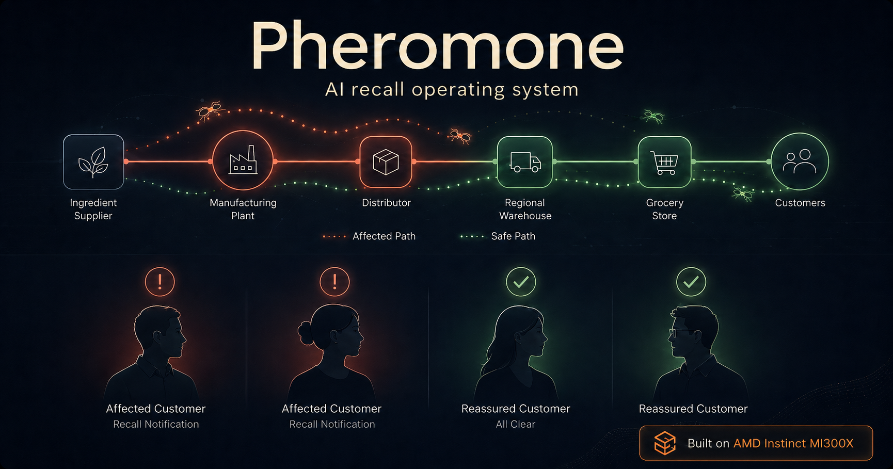
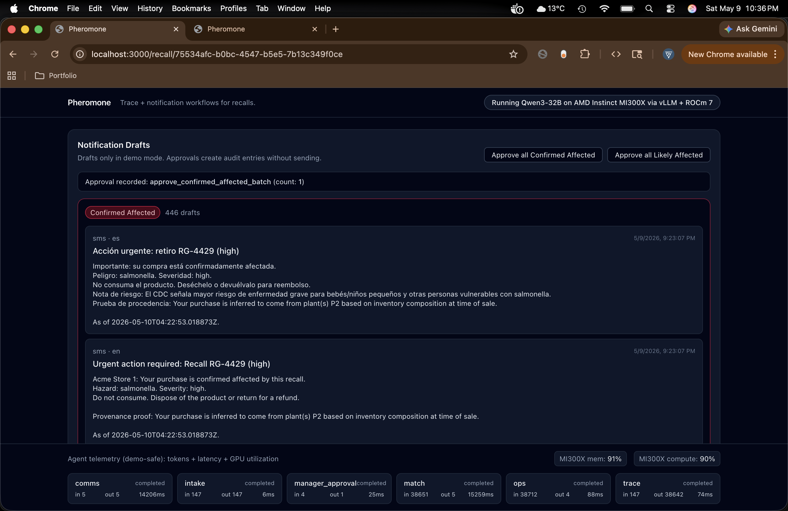
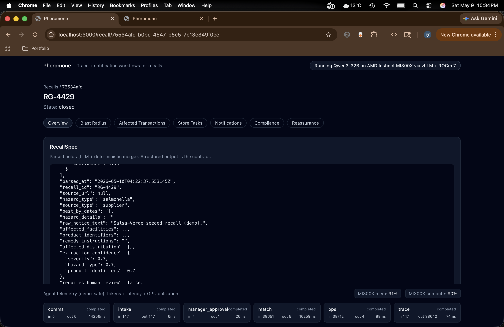
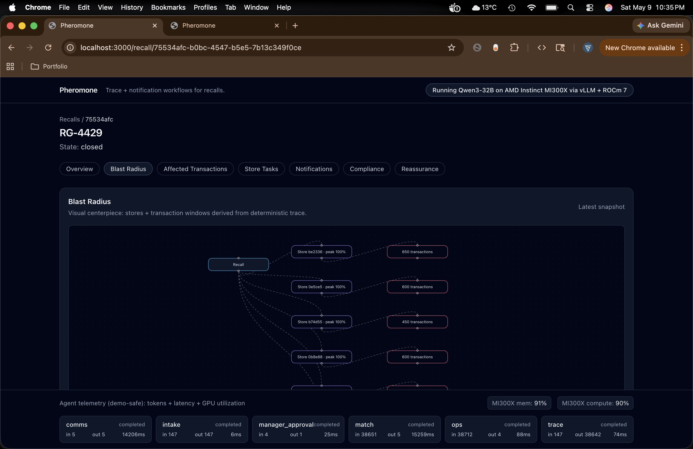

# Pheromone — AI Recall Operating System

Pheromone is a professional recall operations system for food retail and supply-chain teams. It ingests recall notices, traces affected products through a supply-chain graph, matches likely impacted transactions, drafts customer-safe communications (including reassurance for unaffected customers), and produces an audit-ready compliance trail.



## What it does

- Trace affected products through the supply chain.
- Identify affected transactions with confidence tiers.
- Notify impacted customers with customer-safe draft workflows.
- Reassure safe customers using provenance evidence from the supply-chain graph.
- Generate audit-ready recall artifacts (timeline + approvals + deterministic logs).

## Workflow

1. Intake recall notice → structured `RecallSpec`
2. Trace supply-chain graph → exposure paths + affected lots
3. Match transactions → impacted purchases + confidence
4. Classify customer risk tier → affected / safe / unknown
5. Generate notifications → comms drafts + operational tasks
6. Produce compliance report → append-only event timeline

## Agents (contracted responsibilities)

- **Intake Agent**: recall notice → `RecallSpec` (schema contract)
- **Trace Agent**: `RecallSpec` + entities → exposure graph + affected lots
- **Match Agent**: exposure evidence + sales → impacted transactions + confidence
- **Ops Agent**: impact set → store tasks (pulls, quarantine, POS blocks)
- **Comms Agent**: risk tier + evidence → tiered notification drafts + reassurance

## Reassurance (differentiator)

Most recall systems stop at notifying affected customers. Pheromone also generates *reassurance* for customers who are not affected, backed by provenance evidence from the supply-chain trace.




## Dashboard screenshots




## Local quickstart (dashboard)

From repo root:

```bash
# 1. Start local Postgres
./scripts/start_local_postgres.sh

# 2. Seed the demo recall (Salsa-Verde, fully populated)
./.venv/bin/python scripts/seed_demo_recall.py --reset

# 3. Start backend
./.venv/bin/python -m uvicorn backend.api.main:app --reload --port 8001

# 4. Start frontend (new terminal)
cd frontend
NEXT_PUBLIC_API_BASE_URL=http://127.0.0.1:8001 npm run dev
```

Then open `http://localhost:3000`.

### CORS (local dev)

The FastAPI backend enables CORS for local dashboard development. You can override allowed origins with:

- `PHEROMONE_CORS_ORIGINS=http://localhost:3000,http://127.0.0.1:3000`

## Hugging Face Space (static walkthrough UI)

The Hugging Face Space serves a static walkthrough (HTML/CSS/JS), separate from the Next.js dashboard:

- `hf-space-pheromone/app/`
- `infra/hf_space/app/` (mirrored copy used for infra packaging)

## Tests

Run the backend + generator tests from repo root:

```bash
./.venv/bin/python -m pytest backend/tests/ data_generator/tests/ -v
```

## Repo layout

- `backend/`: FastAPI API + agents + orchestration + DB logic
- `frontend/`: Next.js dashboard UI
- `data_generator/`: synthetic supply-chain + POS data generator
- `hf-space-pheromone/`: static Space UI (Docker/Nginx)
- `docs/`: project context, architecture notes, runbook, screenshots

